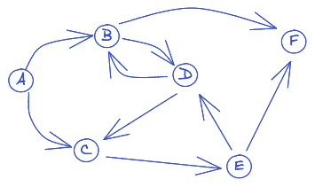

# Connected Friends

You work for a massive social network with many millions of users. You need to determine if two given users of the network are connected to each other.

Users of the social network may "follow" each other but the relationship may not be mutual. That is, person A may follow person B but person B may not necessarily follow person A.

Consider the diagrammatic representation of a part of the network below:



In this diagram an arrow indicates that who a user follows.

- A follows B and C
- B follows D and D follows B
- Both E and B follow F
- F does not follow anyone
- A has no followers

The objective is to search for a path from any given user to any other user. For example, there is a path from `B` to `E`. That path is `B -> D -> C -> E`. But there is no path from `E` to `A`.

Internally, this network of users and their connections may be represented as an object where the keys are the user's identity and the values are an array of users that they follow. The above network may be represented as follows:

```json
{
  "A": ["B", "C"],
  "B": ["F", "D"],
  "C": ["E"],
  "D": ["C", "B"],
  "E": ["D", "F"],
  "F": []
}
```

Write a function that accepts a network object `G` and two users `s` and `r` and returns `true` if there is a path from `s` to `r`, false otherwise.
